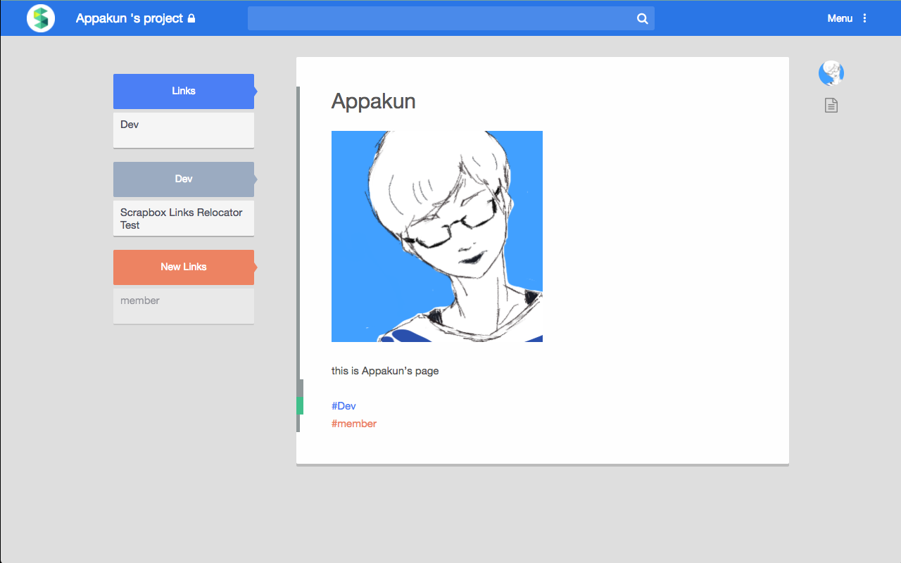

# Scrapbox Links Relocator
## なにこれ
[Scrapbox](https://scrapbox.io/ "Scrapbox")の編集ページにおいて，本来最下部に表示されるタグ・リンクを，新たなカラムとして編集フィールドの左側に移動させる機能を提供する拡張機能です．
インストールすることで，[https://scrapbox.io/*](https://scrapbox.io/*)を読み込んだ際に自動的に起動します．  
こんな感じ．

## インストール
[Chromeストア](https://chrome.google.com/webstore/detail/scrapbox-links-relocator/ikgdedlfcejdjkhkhgpdfdnbjkmlgbfd?hl=ja "Chromeストア")からどうぞ．
